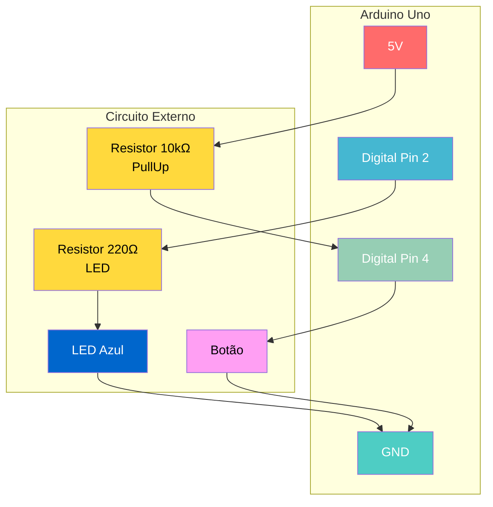
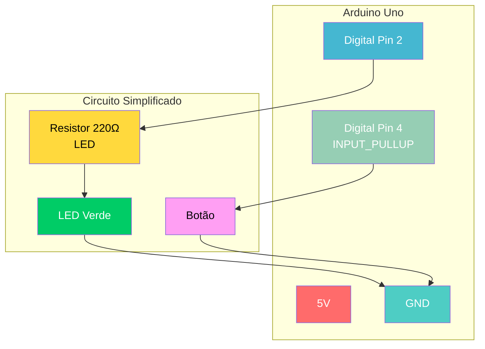
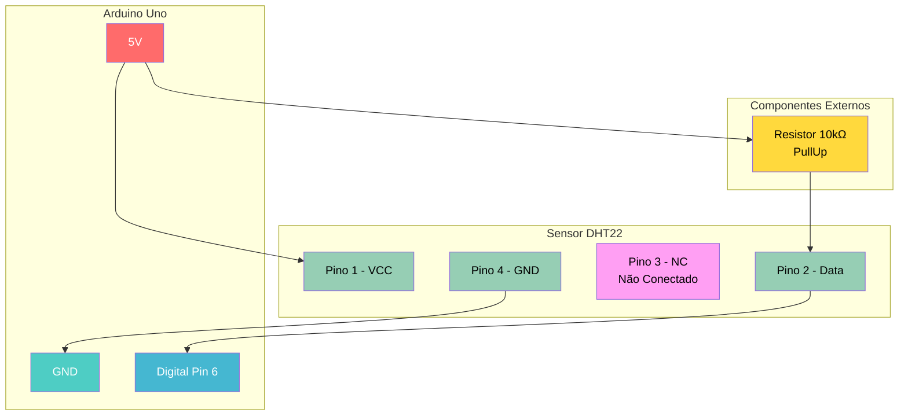
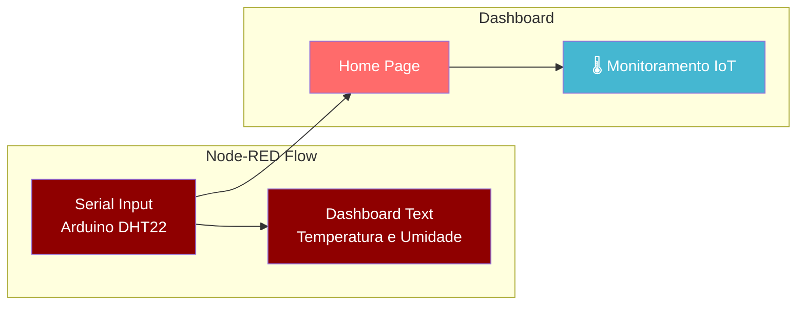

# ⚡ Check Point 5 - Disruptive Architectures IoT

## 🔧 Prática - Implementações Arduino e Node-RED

<div align="center">


**Desenvolvido por:** Paulo André Carminati | **RM:** 557881 | **Turma:** 2TDSPZ  
**Data:** 19/10/2025 | **Semestre:** 2/2025

</div>

---

## 📋 Índice de Navegação

- [⚡ Check Point 5 - Disruptive Architectures IoT](#-check-point-5---disruptive-architectures-iot)
  - [🔧 Prática - Implementações Arduino e Node-RED](#-prática---implementações-arduino-e-node-red)
  - [📋 Índice de Navegação](#-índice-de-navegação)
  - [🔘 Questão 2 - LED com Botão (PullUp Externo)](#-questão-2---led-com-botão-pullup-externo)
    - [📋 **Especificações:**](#-especificações)
    - [2A - Código Arduino](#2a---código-arduino)
    - [2B - Diagrama do Circuito](#2b---diagrama-do-circuito)
  - [🔄 Questão 3 - LED Toggle (PullUp Interno)](#-questão-3---led-toggle-pullup-interno)
    - [📋 **Especificações:**](#-especificações-1)
    - [3A - Código Arduino](#3a---código-arduino)
    - [3B - Diagrama do Circuito](#3b---diagrama-do-circuito)
  - [🌡️ Questão 4 - Sensor DHT](#️-questão-4---sensor-dht)
    - [📋 **Especificações:**](#-especificações-2)
    - [4A - Código Arduino](#4a---código-arduino)
    - [4B - Diagrama do Circuito](#4b---diagrama-do-circuito)
    - [4C - Configuração Node-RED](#4c---configuração-node-red)
  - [📁 Estrutura de Arquivos](#-estrutura-de-arquivos)
  - [🚀 Instruções de Execução](#-instruções-de-execução)
    - [📋 **Pré-requisitos:**](#-pré-requisitos)
    - [🔧 **Passos para Execução:**](#-passos-para-execução)
      - [**1. Preparação do Ambiente:**](#1-preparação-do-ambiente)
      - [**2. Instalação da Biblioteca DHT:**](#2-instalação-da-biblioteca-dht)
      - [**3. Upload dos Códigos:**](#3-upload-dos-códigos)
      - [**4. Configuração do Node-RED:**](#4-configuração-do-node-red)
    - [📊 **Resultados Esperados:**](#-resultados-esperados)

---

## 🔘 Questão 2 - LED com Botão (PullUp Externo)

### 📋 **Especificações:**

- **Botão:** Porta 4 do Arduino
- **LED:** Porta 2 do Arduino (cor: Azul)
- **PullUp:** Resistor externo de 10kΩ conectado ao VCC
- **Comportamento:** LED acende quando botão pressionado, apaga quando solto
- **Delay:** 0.7 segundos nas transições

### 2A - Código Arduino

```cpp
/*
 * Questão 2A - LED com Botão (PullUp Externo)
 * Desenvolvido por: Paulo André Carminati - RM: 557881
 * Data: 19/10/2025
 * 
 * Funcionalidade: 
 * - LED acende quando botão é pressionado
 * - LED apaga quando botão é solto
 * - PullUp externo de 10kΩ
 * - Delay de 0.7s nas transições
 */

// Definição dos pinos
const int BOTAO_PIN = 4;    // Pino do botão
const int LED_PIN = 2;      // Pino do LED (Azul)

void setup() {
  // Configuração dos pinos
  pinMode(BOTAO_PIN, INPUT);   // Botão como entrada (PullUp externo)
  pinMode(LED_PIN, OUTPUT);    // LED como saída
  
  // Inicialização da comunicação serial
  Serial.begin(9600);
  Serial.println("=== QUESTÃO 2A - LED COM BOTÃO (PULLUP EXTERNO) ===");
  Serial.println("Desenvolvido por: Paulo André Carminati - RM: 557881");
  Serial.println("LED acende quando botão pressionado, apaga quando solto");
  Serial.println("Delay: 0.7 segundos");
  Serial.println("----------------------------------------");
}

void loop() {
  // Leitura do estado do botão
  int estadoBotao = digitalRead(BOTAO_PIN);
  
  // Verificação do estado do botão (LOW = pressionado com PullUp)
  if (estadoBotao == LOW) {
    // Botão pressionado - LED ligado
    digitalWrite(LED_PIN, HIGH);
    Serial.println("🔵 LED LIGADO - Botão pressionado");
    delay(700);  // Delay de 0.7 segundos
  } else {
    // Botão solto - LED desligado
    digitalWrite(LED_PIN, LOW);
    Serial.println("⚫ LED DESLIGADO - Botão solto");
    delay(700);  // Delay de 0.7 segundos
  }
}
```

### 2B - Diagrama do Circuito



**🔌 Conexões Detalhadas:**

- **VCC (5V)** → **Resistor 10kΩ** → **Pino 4** → **Botão** → **GND**
- **Pino 2** → **Resistor 220Ω** → **LED Azul** → **GND**

---

## 🔄 Questão 3 - LED Toggle (PullUp Interno)

### 📋 **Especificações:**

- **Botão:** Porta 4 do Arduino
- **LED:** Porta 2 do Arduino (cor: Verde)
- **PullUp:** Interno do Arduino (INPUT_PULLUP)
- **Comportamento:** LED toggle (liga/desliga) a cada pressionamento
- **Delay:** 1 segundo nas transições

### 3A - Código Arduino

```cpp
/*
 * Questão 3A - LED Toggle (PullUp Interno)
 * Desenvolvido por: Paulo André Carminati - RM: 557881
 * Data: 19/10/2025
 * 
 * Funcionalidade: 
 * - LED toggle (liga/desliga) a cada pressionamento
 * - PullUp interno do Arduino
 * - Delay de 1s nas transições
 * - Detecta mudança de estado (edge detection)
 */

// Definição dos pinos
const int BOTAO_PIN = 4;    // Pino do botão
const int LED_PIN = 2;      // Pino do LED (Verde)

// Variáveis de controle
bool ledLigado = false;                    // Estado atual do LED
bool ultimoEstadoBotao = HIGH;             // Estado anterior do botão
bool estadoAtualBotao;                     // Estado atual do botão

void setup() {
  // Configuração dos pinos
  pinMode(BOTAO_PIN, INPUT_PULLUP);  // Botão com PullUp interno
  pinMode(LED_PIN, OUTPUT);          // LED como saída
  
  // Inicialização da comunicação serial
  Serial.begin(9600);
  Serial.println("=== QUESTÃO 3A - LED TOGGLE (PULLUP INTERNO) ===");
  Serial.println("Desenvolvido por: Paulo André Carminati - RM: 557881");
  Serial.println("LED toggle a cada pressionamento do botão");
  Serial.println("Delay: 1 segundo");
  Serial.println("----------------------------------------");
  
  // Estado inicial do LED
  digitalWrite(LED_PIN, LOW);
  Serial.println("🟢 Estado inicial: LED DESLIGADO");
}

void loop() {
  // Leitura do estado atual do botão
  estadoAtualBotao = digitalRead(BOTAO_PIN);
  
  // Detecção de mudança de estado (HIGH → LOW = pressionamento)
  if (ultimoEstadoBotao == HIGH && estadoAtualBotao == LOW) {
    // Botão foi pressionado - fazer toggle do LED
    ledLigado = !ledLigado;  // Inverte o estado do LED
    
    if (ledLigado) {
      digitalWrite(LED_PIN, HIGH);
      Serial.println("🟢 LED LIGADO - Toggle ativado");
    } else {
      digitalWrite(LED_PIN, LOW);
      Serial.println("⚫ LED DESLIGADO - Toggle ativado");
    }
    
    delay(1000);  // Delay de 1 segundo
  }
  
  // Atualiza o estado anterior do botão
  ultimoEstadoBotao = estadoAtualBotao;
}
```

### 3B - Diagrama do Circuito



**🔌 Conexões Detalhadas:**

- **Pino 4** → **Botão** → **GND** (PullUp interno ativado)
- **Pino 2** → **Resistor 220Ω** → **LED Verde** → **GND**

---

## 🌡️ Questão 4 - Sensor DHT

### 📋 **Especificações:**

- **Sensor:** DHT22 (AM2302)
- **Pino de dados:** Porta 6 do Arduino
- **PullUp:** Resistor externo de 10kΩ entre VCC e pino de dados
- **Alimentação:** 5V (VCC)
- **GND:** Conectado ao GND do Arduino
- **NC:** Pino 3 não conectado
- **Saída:** Dados de temperatura e umidade via Serial

### 4A - Código Arduino

```cpp
/*
 * Questão 4A - Sensor DHT22
 * Desenvolvido por: Paulo André Carminati - RM: 557881
 * Data: 19/10/2025
 * 
 * Funcionalidade: 
 * - Leitura de temperatura e umidade do sensor DHT22
 * - PullUp externo de 10kΩ
 * - Exibição formatada na porta serial
 * - Verificação de erros de leitura
 */

#include <DHT.h>

// Definição dos pinos e tipo do sensor
#define DHT_PIN 6        // Pino de dados do sensor
#define DHT_TYPE DHT22   // Tipo do sensor (DHT22)

// Inicialização do objeto DHT
DHT dht(DHT_PIN, DHT_TYPE);

void setup() {
  // Inicialização da comunicação serial
  Serial.begin(9600);
  Serial.println("=== QUESTÃO 4A - SENSOR DHT22 ===");
  Serial.println("Desenvolvido por: Paulo André Carminati - RM: 557881");
  Serial.println("Monitoramento de Temperatura e Umidade");
  Serial.println("----------------------------------------");
  
  // Inicialização do sensor DHT
  dht.begin();
  Serial.println("🌡️ Sensor DHT22 inicializado com sucesso!");
  Serial.println("📊 Iniciando leituras...");
  Serial.println();
  
  // Cabeçalho da tabela
  Serial.println("┌─────────────┬─────────────┬─────────────┐");
  Serial.println("│ Temperatura │   Umidade   │    Status   │");
  Serial.println("├─────────────┼─────────────┼─────────────┤");
}

void loop() {
  // Aguarda 2 segundos entre leituras (recomendado para DHT22)
  delay(2000);
  
  // Leitura da temperatura e umidade
  float temperatura = dht.readTemperature();
  float umidade = dht.readHumidity();
  
  // Verificação se a leitura foi bem-sucedida
  if (isnan(temperatura) || isnan(umidade)) {
    Serial.println("│     ERRO     │     ERRO     │   FALHA     │");
    Serial.println("└─────────────┴─────────────┴─────────────┘");
    Serial.println("❌ Erro na leitura do sensor DHT22!");
    Serial.println("🔧 Verifique as conexões e tente novamente.");
    return;
  }
  
  // Exibição dos dados formatados
  Serial.print("│   ");
  Serial.print(temperatura, 1);
  Serial.print("°C     │   ");
  Serial.print(umidade, 1);
  Serial.print("%      │   OK        │");
  Serial.println();
  
  // Linha separadora
  Serial.println("├─────────────┼─────────────┼─────────────┤");
  
  // Informações adicionais
  Serial.print("📈 Temperatura: ");
  Serial.print(temperatura, 1);
  Serial.print("°C | 💧 Umidade: ");
  Serial.print(umidade, 1);
  Serial.println("%");
  
  // Análise das condições
  if (temperatura > 30.0) {
    Serial.println("🔥 Temperatura alta detectada!");
  } else if (temperatura < 15.0) {
    Serial.println("❄️ Temperatura baixa detectada!");
  }
  
  if (umidade > 70.0) {
    Serial.println("💦 Umidade alta detectada!");
  } else if (umidade < 30.0) {
    Serial.println("🏜️ Umidade baixa detectada!");
  }
  
  Serial.println("─────────────────────────────────────────");
}
```

### 4B - Diagrama do Circuito



**🔌 Conexões Detalhadas:**

- **VCC (5V)** → **Pino 1 (VCC)** do DHT22
- **VCC (5V)** → **Resistor 10kΩ** → **Pino 2 (Data)** do DHT22
- **Pino 2 (Data)** do DHT22 → **Pino 6** do Arduino
- **Pino 4 (GND)** do DHT22 → **GND** do Arduino
- **Pino 3 (NC)** → Não conectado

### 4C - Configuração Node-RED

**📋 Especificações:**

- **Nó de entrada:** Serial Input para receber dados do Arduino
- **Nó de saída:** Dashboard Text para exibição
- **Página:** Home do dashboard
- **Arquivo:** `node_conf.json`

**🔧 Configuração JSON (node_conf.json):**

```json
[
    {
        "id": "serial-input",
        "type": "serial in",
        "z": "flow1",
        "name": "Arduino Serial DHT22",
        "serial": "serial-port",
        "x": 200,
        "y": 100,
        "wires": [["dashboard-output"]]
    },
    {
        "id": "dashboard-output",
        "type": "ui_text",
        "z": "flow1",
        "group": "dashboard-group",
        "order": 1,
        "width": 0,
        "height": 0,
        "name": "Dados do Sensor DHT22",
        "label": "🌡️ Temperatura e Umidade",
        "format": "{{msg.payload}}",
        "layout": "row-center",
        "x": 400,
        "y": 100,
        "wires": []
    },
    {
        "id": "dashboard-group",
        "type": "ui_group",
        "name": "Monitoramento IoT",
        "tab": "dashboard-tab",
        "order": 1,
        "disp": true,
        "width": "6"
    },
    {
        "id": "dashboard-tab",
        "type": "ui_tab",
        "name": "Home",
        "icon": "dashboard",
        "order": 1
    }
]
```

**📊 Fluxo Node-RED:**



---

## 📁 Estrutura de Arquivos

```
📦 DISRUPTIVE_ARCHITECTURES_IOT_IOB_And_GENERATIVE_CP_2SEM_2025/
├── 📄 README.md
├── 📚 questoes_teoricas.md
├── ⚡ questoes praticas.md
├── 🔧 codigos/
│   ├── questao_2a.ino          # LED com Botão (PullUp Externo)
│   ├── questao_3a.ino          # LED Toggle (PullUp Interno)
│   └── questao_4a.ino          # Sensor DHT22
├── 🖼️ imagens/
│   ├── circuito_questao_2.png  # Diagrama Questão 2
│   ├── circuito_questao_3.png  # Diagrama Questão 3
│   └── circuito_questao_4.png  # Diagrama Questão 4
└── 🔗 node-red/
    └── node_conf.json          # Configuração Node-RED
```

---

## 🚀 Instruções de Execução

### 📋 **Pré-requisitos:**

- [x] **Arduino IDE** instalado
- [x] **Node-RED** instalado
- [x] **Biblioteca DHT sensor library** instalada
- [x] **Arduino Uno** ou compatível
- [x] **Componentes:**
  - 2x Botões
  - 2x LEDs (Azul e Verde)
  - 3x Resistores 220Ω
  - 2x Resistores 10kΩ
  - 1x Sensor DHT22
  - Protoboard e jumpers

### 🔧 **Passos para Execução:**

#### **1. Preparação do Ambiente:**

```bash
# Clone o repositório
git clone https://github.com/seu-usuario/disruptive-architectures-iot.git

# Navegue para o diretório
cd disruptive-architectures-iot
```

#### **2. Instalação da Biblioteca DHT:**

1. Abra o Arduino IDE
2. Vá em **Sketch** → **Include Library** → **Manage Libraries**
3. Procure por "DHT sensor library"
4. Instale a biblioteca de **Adafruit**

#### **3. Upload dos Códigos:**

1. Abra cada arquivo `.ino` no Arduino IDE
2. Compile e faça upload para o Arduino
3. Abra o Monitor Serial (9600 baud)

#### **4. Configuração do Node-RED:**

1. Inicie o Node-RED
2. Acesse `http://localhost:1880`
3. Importe o arquivo `node_conf.json`
4. Configure a porta serial correta
5. Acesse o dashboard em `http://localhost:1880/ui`

### 📊 **Resultados Esperados:**

| Questão | Funcionalidade | Status |
|---------|----------------|--------|
| **2A** | LED acende/apaga com botão | ✅ |
| **2B** | Diagrama do circuito | ✅ |
| **3A** | LED toggle com botão | ✅ |
| **3B** | Diagrama do circuito | ✅ |
| **4A** | Leitura sensor DHT22 | ✅ |
| **4B** | Diagrama do circuito | ✅ |
| **4C** | Visualização Node-RED | ✅ |

---

<div align="center">

**🎓 FIAP - Faculdade de Informática e Administração Paulista**  
*Disruptive Architectures IoT - Semestre 2/2025*

**Desenvolvido por:** Paulo André Carminati | **RM:** 557881 | **Turma:** 2TDSPZ

---


</div>
