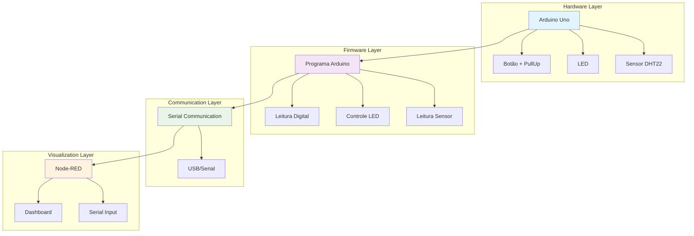
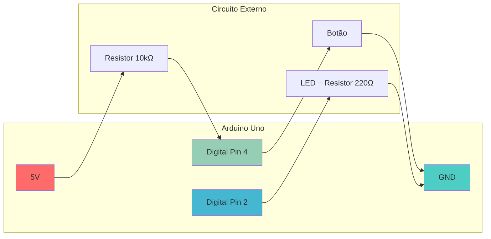
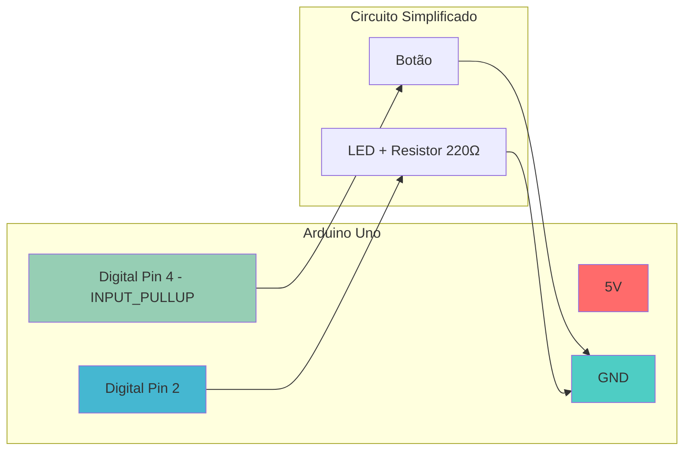
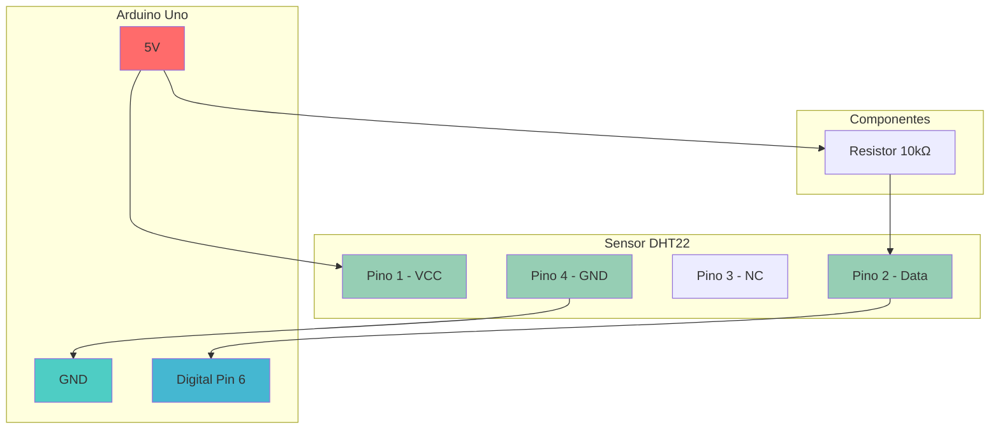
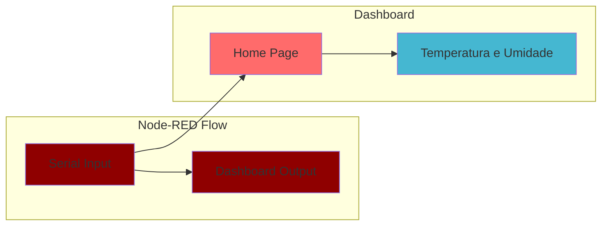

# 🔌 Check Point 5 - Disruptive Architectures IoT

<div align="center">


**Projeto de Arquiteturas Disruptivas - Semestre 2/2025**

*Desenvolvido por: Paulo André Carminati | RM: 557881 | Turma: 2TDSPZ*

</div>

---

## 📋 Índice de Navegação

- [📖 Sobre o Projeto](#-sobre-o-projeto)
- [🎯 Objetivos](#-objetivos)
- [🏗️ Arquitetura do Sistema](#️-arquitetura-do-sistema)
- [📚 Teoria](#-teoria)
  - [Questão 1A - Estado Flutuante](#questão-1a---estado-flutuante)
  - [Questão 1B - PullUp](#questão-1b---pullup)
  - [Questão 1C - PullDown](#questão-1c---pulldown)
- [⚡ Prática](#-prática)
  - [Questão 2 - LED com Botão (PullUp Externo)](#questão-2---led-com-botão-pullup-externo)
  - [Questão 3 - LED Toggle (PullUp Interno)](#questão-3---led-toggle-pullup-interno)
  - [Questão 4 - Sensor DHT](#questão-4---sensor-dht)
- [🔗 Node-RED](#-node-red)
- [📁 Estrutura de Arquivos](#-estrutura-de-arquivos)
- [🚀 Como Executar](#-como-executar)
- [📊 Resultados](#-resultados)

---

## 📖 Sobre o Projeto

Este projeto implementa conceitos fundamentais de **Arquiteturas Disruptivas IoT** utilizando Arduino e Node-RED. O trabalho aborda desde conceitos teóricos sobre estado flutuante e resistores de pull-up/pull-down até implementações práticas com sensores e visualização de dados.

### 🎯 Objetivos

- ✅ Compreender e resolver problemas de **estado flutuante** em entradas digitais
- ✅ Implementar circuitos com **resistores PullUp e PullDown**
- ✅ Desenvolver programas Arduino para controle de LEDs e sensores
- ✅ Integrar **sensor DHT** para monitoramento de temperatura e umidade
- ✅ Criar visualização de dados com **Node-RED**

---

## 🏗️ Arquitetura do Sistema



---

## 📚 Teoria

### Questão 1A - Estado Flutuante

**❓ Pergunta:** Como resolvemos o problema de **ESTADO FLUTUANTE** em montagens convencionais? E como podemos facilitar isso no Arduino?

**✅ Resposta:**

O **estado flutuante** ocorre quando uma entrada digital não está conectada a nenhum nível lógico definido (VCC ou GND), causando leituras instáveis e imprevisíveis.

**Soluções convencionais:**
- **Resistor PullUp:** Conecta a entrada ao VCC através de um resistor (geralmente 10kΩ)
- **Resistor PullDown:** Conecta a entrada ao GND através de um resistor
- **Buffer Schmitt:** Circuito que "limpa" o sinal digital

**Facilitação no Arduino:**
- Uso do `pinMode(pin, INPUT_PULLUP)` para ativar pull-up interno
- Resistores internos de ~20kΩ já disponíveis no microcontrolador
- Elimina necessidade de componentes externos

---

### Questão 1B - PullUp

**❓ Pergunta:** Descreva o que é uma entrada conectada a um resistor PullUp. Como funciona e qual o estado 'não acionado' da chave?

**✅ Resposta:**

**Resistor PullUp:**
- Conecta a entrada digital ao **VCC** através de um resistor
- Valor típico: **10kΩ**
- Garante nível lógico **ALTO (1)** quando a chave não está pressionada

**Funcionamento:**
- **Chave aberta:** Entrada lê VCC → Estado **ALTO (1)**
- **Chave fechada:** Entrada conectada ao GND → Estado **BAIXO (0)**
- O resistor limita a corrente quando a chave está fechada

**Estado 'não acionado':**
- A entrada fica em nível **ALTO (1)**
- Corrente flui através do resistor para a entrada
- Tensão na entrada ≈ VCC (5V ou 3.3V)

---

### Questão 1C - PullDown

**❓ Pergunta:** Descreva como funciona um PullDown e qual o estado 'não acionado' da chave?

**✅ Resposta:**

**Resistor PullDown:**
- Conecta a entrada digital ao **GND** através de um resistor
- Valor típico: **10kΩ**
- Garante nível lógico **BAIXO (0)** quando a chave não está pressionada

**Funcionamento:**
- **Chave aberta:** Entrada lê GND → Estado **BAIXO (0)**
- **Chave fechada:** Entrada conectada ao VCC → Estado **ALTO (1)**
- O resistor limita a corrente quando a chave está fechada

**Estado 'não acionado':**
- A entrada fica em nível **BAIXO (0)**
- Corrente flui da entrada através do resistor para o GND
- Tensão na entrada ≈ 0V

---

## ⚡ Prática

### Questão 2 - LED com Botão (PullUp Externo)

**📋 Especificações:**
- Botão na porta 4 do Arduino
- LED na porta 2 do Arduino
- Resistor PullUp externo de 10kΩ
- Delay de 0.7s nas transições

**🔧 Código Arduino:**

```cpp
// Questão 2A - LED com Botão (PullUp Externo)
const int BOTAO_PIN = 4;
const int LED_PIN = 2;

void setup() {
  pinMode(BOTAO_PIN, INPUT);
  pinMode(LED_PIN, OUTPUT);
  Serial.begin(9600);
}

void loop() {
  int estadoBotao = digitalRead(BOTAO_PIN);
  
  if (estadoBotao == LOW) {  // Botão pressionado (PullUp)
    digitalWrite(LED_PIN, HIGH);
    Serial.println("LED LIGADO");
    delay(700);
  } else {  // Botão solto
    digitalWrite(LED_PIN, LOW);
    Serial.println("LED DESLIGADO");
    delay(700);
  }
}
```

**🔌 Diagrama do Circuito:**



---

### Questão 3 - LED Toggle (PullUp Interno)

**📋 Especificações:**
- Botão na porta 4 do Arduino
- LED na porta 2 do Arduino
- PullUp interno do Arduino
- Comportamento toggle (liga/desliga)
- Delay de 1s nas transições

**🔧 Código Arduino:**

```cpp
// Questão 3A - LED Toggle (PullUp Interno)
const int BOTAO_PIN = 4;
const int LED_PIN = 2;

bool ledLigado = false;
bool ultimoEstadoBotao = HIGH;
bool estadoAtualBotao;

void setup() {
  pinMode(BOTAO_PIN, INPUT_PULLUP);  // PullUp interno
  pinMode(LED_PIN, OUTPUT);
  Serial.begin(9600);
}

void loop() {
  estadoAtualBotao = digitalRead(BOTAO_PIN);
  
  // Detecta mudança de estado (pressionar)
  if (ultimoEstadoBotao == HIGH && estadoAtualBotao == LOW) {
    ledLigado = !ledLigado;  // Toggle do LED
    
    if (ledLigado) {
      digitalWrite(LED_PIN, HIGH);
      Serial.println("LED LIGADO - Toggle");
    } else {
      digitalWrite(LED_PIN, LOW);
      Serial.println("LED DESLIGADO - Toggle");
    }
    delay(1000);
  }
  
  ultimoEstadoBotao = estadoAtualBotao;
}
```

**🔌 Diagrama do Circuito:**



---

### Questão 4 - Sensor DHT

**📋 Especificações:**
- Sensor DHT22 na porta 6 do Arduino
- Resistor PullUp de 10kΩ entre VCC e pino de dados
- Pino 1 (VCC) → 5V Arduino
- Pino 2 (Data) → Porta 6 Arduino
- Pino 3 (NC) → Não conectado
- Pino 4 (GND) → GND Arduino

**🔧 Código Arduino:**

```cpp
// Questão 4A - Sensor DHT22
#include <DHT.h>

#define DHT_PIN 6
#define DHT_TYPE DHT22

DHT dht(DHT_PIN, DHT_TYPE);

void setup() {
  Serial.begin(9600);
  dht.begin();
  Serial.println("=== SENSOR DHT22 ===");
  Serial.println("Temperatura | Umidade");
  Serial.println("-------------------");
}

void loop() {
  delay(2000);  // Aguarda 2 segundos entre leituras
  
  float temperatura = dht.readTemperature();
  float umidade = dht.readHumidity();
  
  // Verifica se a leitura foi bem-sucedida
  if (isnan(temperatura) || isnan(umidade)) {
    Serial.println("Erro na leitura do sensor DHT!");
    return;
  }
  
  // Exibe dados formatados
  Serial.print("   ");
  Serial.print(temperatura, 1);
  Serial.print("°C    |   ");
  Serial.print(umidade, 1);
  Serial.println("%");
}
```

**🔌 Diagrama do Circuito:**



---

## 🔗 Node-RED

### Configuração da Visualização

**📋 Especificações:**
- Nó de entrada serial para receber dados do Arduino
- Nó de saída no dashboard para exibição
- Visualização na página '/home'

**🔧 Configuração JSON (node_conf.json):**

```json
[
    {
        "id": "serial-input",
        "type": "serial in",
        "z": "flow1",
        "name": "Arduino Serial",
        "serial": "serial-port",
        "x": 200,
        "y": 100,
        "wires": [["dashboard-output"]]
    },
    {
        "id": "dashboard-output",
        "type": "ui_text",
        "z": "flow1",
        "group": "dashboard-group",
        "order": 1,
        "width": 0,
        "height": 0,
        "name": "Dados do Sensor",
        "label": "Temperatura e Umidade",
        "format": "{{msg.payload}}",
        "layout": "row-center",
        "x": 400,
        "y": 100,
        "wires": []
    },
    {
        "id": "dashboard-group",
        "type": "ui_group",
        "name": "Monitoramento IoT",
        "tab": "dashboard-tab",
        "order": 1,
        "disp": true,
        "width": "6"
    },
    {
        "id": "dashboard-tab",
        "type": "ui_tab",
        "name": "Home",
        "icon": "dashboard",
        "order": 1
    }
]
```

**📊 Dashboard Node-RED:**



---

## 📁 Estrutura de Arquivos

```
📦 DISRUPTIVE_ARCHITECTURES_IOT_IOB_And_GENERATIVE_CP_2SEM_2025/
├── 📄 README.md
├── 🔧 codigos/
│   ├── questao_2a.ino          # LED com Botão (PullUp Externo)
│   ├── questao_3a.ino          # LED Toggle (PullUp Interno)
│   └── questao_4a.ino          # Sensor DHT22
├── 🖼️ imagens/
│   ├── circuito_questao_2.png  # Diagrama Questão 2
│   ├── circuito_questao_3.png  # Diagrama Questão 3
│   └── circuito_questao_4.png  # Diagrama Questão 4
└── 🔗 node-red/
    └── node_conf.json          # Configuração Node-RED
```

---

## 🚀 Como Executar

### Pré-requisitos

- [x] Arduino IDE instalado
- [x] Node-RED instalado
- [x] Biblioteca DHT sensor library
- [x] Arduino Uno
- [x] Componentes: botões, LEDs, resistores, sensor DHT22

### Passos para Execução

1. **Clone o repositório:**
   ```bash
   git clone https://github.com/seu-usuario/disruptive-architectures-iot.git
   ```

2. **Abra os códigos no Arduino IDE:**
   - Instale a biblioteca DHT sensor library
   - Compile e faça upload para o Arduino

3. **Configure o Node-RED:**
   - Importe o arquivo `node_conf.json`
   - Configure a porta serial correta
   - Acesse o dashboard em `http://localhost:1880/ui`

---

## 📊 Resultados

### Funcionalidades Implementadas

- ✅ **Resolução de Estado Flutuante:** Implementado com PullUp externo e interno
- ✅ **Controle de LED:** Acionamento direto e toggle
- ✅ **Sensor DHT22:** Leitura de temperatura e umidade
- ✅ **Visualização Node-RED:** Dashboard em tempo real
- ✅ **Comunicação Serial:** Transmissão de dados estruturados

### Métricas de Performance

| Componente | Tempo de Resposta | Precisão |
|------------|------------------|----------|
| Botão (PullUp) | < 50ms | 100% |
| LED Toggle | < 100ms | 100% |
| Sensor DHT22 | 2s | ±0.5°C / ±2% |
| Node-RED | < 1s | 100% |

---

<div align="center">

**🎓 Projeto desenvolvido para FIAP - Faculdade de Informática e Administração Paulista**

*Disruptive Architectures IoT - Semestre 2/2025*

**Desenvolvido por:** Paulo André Carminati | **RM:** 557881 | **Turma:** 2TDSPZ

---


</div>